<p align="center">
  
</p>

# 📬 TempMail Unofficial API — Multi-Language Wrappers

<p align="center">
  <strong>v1.0.0</strong> — Released 2026-06-30 &nbsp;|&nbsp; <a href="./RELEASE_NOTES.md">Release Notes</a> &nbsp;|&nbsp; <a href="./CHANGELOG.md">Changelog</a> &nbsp;|&nbsp; <a href="./PLAN_v1.1.0.md">v1.1.0 Plan</a>
</p>

[🇬🇧 English](./README.md) | [🇮🇩 Bahasa Indonesia](./README.id.md) | [🇨🇳 中文](./README.cn.md)

---

Collection of **unofficial wrappers** for various Temporary Email services, written in **7 programming languages**. One repo, one goal: programmatically create and manage disposable emails with ease.

## 🎯 Supported Languages

| Language | Folder | Package Manager | Status |
|----------|--------|-----------------|--------|
| Go | [`/go`](./go) | `go get` | ✅ Done |
| Python | [`/python`](./python) | `pip` | ✅ Done |
| Java | [`/java`](./java) | `Maven` / `Gradle` | ✅ Done |
| PHP | [`/php`](./php) | `Composer` | ✅ Done |
| JavaScript | [`/javascript`](./javascript) | `npm` / `yarn` | ✅ Done |
| Rust | [`/rust`](./rust) | `cargo` | ✅ Done |
| C# | [`/csharp`](./csharp) | `NuGet` | ✅ Done |

## 🌐 Supported TempMail Services

| # | Service | Website | API Type | Auth | Difficulty |
|---|---------|---------|----------|------|-----------|
| 1 | Mail.tm | mail.tm | REST+JSON | Bearer Token | ✅ Easy |
| 2 | GuerrillaMail | guerrillamail.com | REST | Session Token | ⚡ Medium |
| 3 | YOPmail | yopmail.com | HTML Scraping | None | ⚡ Medium |
| 4 | Dropmail | dropmail.me | GraphQL | Token (auto) | ✅ Easy |
| 5 | 1secemail | 1secemail.com | REST | None | ✅ Easy |

## 📁 Project Structure

```
TempMail-UnofficialAPI/
├── go/               # Go wrapper
├── python/           # Python wrapper
├── java/             # Java wrapper
├── php/              # PHP wrapper
├── javascript/       # Node.js / JavaScript wrapper
├── rust/             # Rust wrapper
├── csharp/           # C# / .NET wrapper
├── README.md         # English (default)
├── README.id.md      # Bahasa Indonesia
├── README.cn.md      # 中文
├── LICENSE           # Apache 2.0
└── NOTICE            # Attribution & disclaimer
```

## 🚀 Quick Start

Each language has its own README. Click the folder above for installation details and usage examples.

### General Example (Pseudocode)

```
// 1. Generate a temporary email
email = tempmail.generate()
// → "random123@mail.tm"

// 2. Check inbox
messages = tempmail.get_inbox(email)

// 3. Read a message
if messages.length > 0:
    content = tempmail.read_message(messages[0].id)

// 4. Delete (optional, auto-expire works too)
tempmail.delete(email)
```

## ⚡ API Interface (All Languages)

All wrappers implement a consistent interface:

| Method | Description | Return |
|--------|-------------|--------|
| `generate_email()` | Generate a temporary email address | `string` (email address) |
| `get_inbox(email)` | Retrieve list of messages | `[]Message` |
| `read_message(id)` | Read message content | `MessageDetail` |
| `delete_email(email)` | Delete email (cleanup) | `bool` |
| `wait_for_email(email, timeout)` | Poll for new messages | `Message` or `null` |

## 📦 Data Model

### Message
- `id` — Unique message identifier
- `from` — Sender address
- `subject` — Email subject
- `date` — Received timestamp

### MessageDetail (extends Message)
- `body_text` — Plain text email body
- `body_html` — HTML email body (if available)
- `attachments` — List of attachment metadata

## 🛡️ Disclaimer

> **⚠️ IMPORTANT**
>
> - This project is **UNOFFICIAL** — not affiliated with any tempmail service.
> - API endpoints may change at any time without notice.
> - Use for **testing, development, or personal automation** only.
> - Do not use for spam, fraud, or any illegal activity.
> - Some services have rate limits — use responsibly.

## 🤝 Contributing

Want to add a language? Fix a bug? Go ahead:

1. Fork this repo
2. Create a branch: `feat/add-kotlin-wrapper`
3. Commit & push
4. Open a Pull Request

### Contribution Guidelines

- Follow the existing interface structure
- Add usage examples in the per-language README
- Never hardcode API keys (use environment variables)
- Test before submitting a PR

## 🗺️ Roadmap

v1.0.0 shipped with 5 services across 7 languages. Planned for upcoming releases:

- **Additional providers** — new temporary email services to be added in v1.1+
- **Improved YOPmail scraping** — resilience against DOM changes and anti-bot improvements
- **WebSocket support** for Dropmail.me (real-time inbox subscription)
- **More languages** — Kotlin, Swift, Ruby pending community interest
- **CLI tool** — unified command-line interface across all providers

Contributions welcome — see [CONTRIBUTING.md](./CONTRIBUTING.md).

## 📄 License

Apache License 2.0 — see [LICENSE](./LICENSE) and [NOTICE](./NOTICE).

---

<p align="center">
  <strong>🌟 Star this repo if it helps your project!</strong><br>
  Built with 🫠 by the community, for the community.
</p>
