<p align="center">
  
</p>

# 📦 C# — TempMail Unofficial Wrappers

<p align="center">
  <strong>v1.1.0</strong> — Released 2026-07-02 &nbsp;|&nbsp; <a href="../RELEASE_NOTES.md">Release Notes</a> &nbsp;|&nbsp; <a href="../CHANGELOG.md">Changelog</a>
</p>

> C#/.NET wrapper for 16 temporary email services. Zero API keys. Uses `HttpClient` + `System.Text.Json`.

## Prerequisites

- .NET 8.0+
- `System.Text.Json` (included in framework, zero third-party dependencies)

## Installation

```bash
dotnet pack TempMail/TempMail.csproj -c Release
dotnet add package TempMail --source ./nupkg
```

Or reference directly:

```xml
<ProjectReference Include="path/to/TempMail/TempMail.csproj" />
```

## Environment Setup

Copy `.env.example` to `.env` and fill in your values:

```bash
cp .env.example .env
```

| Variable | Required | Description |
|----------|:---:|-------------|
| `RESEND_API_KEY` | For E2E tests | Resend API key for test email delivery. Get at [resend.com](https://resend.com/api-keys). |

## Quick Start

```csharp
using TempMail;

var provider = TempMailFactory.Create("mail.tm");

var email = await provider.GenerateEmailAsync();
Console.WriteLine($"Email: {email}");

var message = await provider.WaitForEmailAsync(email,
    TimeSpan.FromMinutes(2), TimeSpan.FromSeconds(5));

if (message is not null)
{
    Console.WriteLine($"From: {message.Sender}");
    Console.WriteLine($"Subject: {message.Subject}");
}
```

## Dropmail Captcha Solver Chain

Dropmail requires solving a captcha to create sessions. You can provide a chain of solver functions — each is tried in order until one returns text.

**Default:** Built-in PaddleOCR via HuggingFace space (no config needed).

```csharp
using TempMail.Providers;
using System.IO;
using System.Collections.Generic;

// Default: uses PaddleOCR via HuggingFace
var dropmailDefault = new DropmailProvider(httpClient);

// Manual solver: show image, user types text
Func<byte[], string> manualSolver = imgBytes => {
    File.WriteAllBytes("captcha.png", imgBytes);
    Console.Write("Enter captcha text: ");
    return Console.ReadLine();
};

// External service (e.g., 2captcha)
Func<byte[], string> externalSolver = imgBytes => {
    // Upload to 2captcha API, wait for result
    // Return the solved text or null on failure
    return null;
};

// Chain: try external first, then PaddleOCR, then manual
var dropmail = new DropmailProvider(httpClient, new List<Func<byte[], string>> {
    externalSolver,
    DropmailProvider.PaddleOcrSolver,
    manualSolver
});
```

Each solver receives the captcha image as `byte[]` and returns `string`. Return `null` to pass to the next solver in the chain.

## Supported Providers

### v1.0.0 Providers (5)

| Provider | Factory Name | Requires API Key | Notes |
|----------|:---:|:---:|:---:|
| Mail.tm | `mail.tm` | No | Account-based |
| GuerrillaMail | `guerrillamail` | No | Session cookies |
| YOPmail | `yopmail` | No | HTML scraping |
| Dropmail.me | `dropmail` | No | GraphQL |
| 1secemail | `1secemail` | No | REST API |

### v1.1.0 Providers (11)

| Provider | Factory Name | Requires API Key | Notes |
|----------|:---:|:---:|:---:|
| emailfake | `emailfake` | No | HTML scraping, surl cookie |
| generator.email | `generator.email` | No | HTML scraping, surl cookie |
| email-temp.com | `email-temp` | No | HTML scraping, surl cookie |
| zoromail | `zoromail` | No | REST API |
| tempmail.lol | `tempmail.lol` | No | REST API, token-based |
| tempmailc | `tempmailc` | No | REST API |
| temp-mail.io | `temp-mail.io` | No | REST API, Bearer token |
| tempmail.plus | `tempmail.plus` | No | REST API, email query |
| mailnesia | `mailnesia` | No | HTML scraping (rate-limited) |
| 10minutemail | `10minutemail` | No | REST API, cookie session |
| ncaori | `ncaori` | No | REST API (nca.my.id) |

## API Reference

### Interface / Contract

All providers implement `ITempMailProvider` (via `TempMailFactory.Create()`):

| Method | Description |
|--------|-------------|
| `GenerateEmailAsync(ct)` | Create a new temporary email address |
| `GetInboxAsync(email, ct)` | List messages for an address |
| `ReadMessageAsync(messageId, ct)` | Get full message content |
| `DeleteEmailAsync(email, ct)` | Delete the email/account |
| `WaitForEmailAsync(email, timeout, interval, ct)` | Poll until first email arrives |

### Data Models

- **`Message`**: `Id`, `Sender`, `Subject`, `Date`
- **`MessageDetail`** extends `Message`: `BodyText`, `BodyHtml`, `Attachments`

### Errors

All extend `TempMailException`:

- **`RateLimitException`** — HTTP 429, has `RetryAfter` property
- **`NotFoundException`** — HTTP 404

## Running Tests

```bash
dotnet test TempMail.Tests/
```

Real HTTP calls against live APIs. No mocks. See [`TEST_REPORT.md`](TEST_REPORT.md) for latest results.

E2E tests use Resend API to send test emails. Set `RESEND_API_KEY` in `.env` before running.

## Examples

See [`examples/`](examples/) directory.

## Links

- [`TEST_REPORT.md`](TEST_REPORT.md) — latest test results
- [`../README.md`](../README.md) — project-wide README
- [`../ARCHITECTURE.md`](../ARCHITECTURE.md) — cross-language architecture
- [`../CONTRIBUTING.md`](../CONTRIBUTING.md) — how to add providers

## License

Apache License 2.0 — see [`../LICENSE`](../LICENSE) and [`../NOTICE`](../NOTICE).

