<p align="center">
  
</p>

# 📦 Go — TempMail Unofficial Wrappers

<p align="center">
  <strong>v1.1.0</strong> — Released 2026-07-01 &nbsp;|&nbsp; <a href="../RELEASE_NOTES.md">Release Notes</a> &nbsp;|&nbsp; <a href="../CHANGELOG.md">Changelog</a>
</p>

> Go module for 15 temporary email services. Zero API keys. Pure stdlib — `net/http` only.

## Prerequisites

- Go 1.21+
- No third-party dependencies — only Go stdlib

## Installation

```bash
go get github.com/josskixg/TempMail-UnofficialAPI/go
```

## Environment Setup

Copy `.env.example` to `.env` and fill in your values:

```bash
cp .env.example .env
```

| Variable | Required | Description |
|----------|:---:|-------------|
| `RESEND_API_KEY` | For E2E tests | Resend API key for test email delivery. Get at [resend.com](https://resend.com/api-keys). |

## Quick Start

```go
package main

import (
    "fmt"
    "log"
    "time"

    tempmail "github.com/josskixg/TempMail-UnofficialAPI/go"
)

func main() {
    provider, err := tempmail.NewProvider("mail.tm", nil)
    if err != nil {
        log.Fatal(err)
    }

    email, err := provider.GenerateEmail()
    if err != nil {
        log.Fatal(err)
    }
    fmt.Println("Email:", email)

    msg, err := provider.WaitForEmail(email, 30*time.Second, 5*time.Second)
    if err != nil {
        log.Fatal(err)
    }

    detail, err := provider.ReadMessage(msg.ID)
    if err != nil {
        log.Fatal(err)
    }
    fmt.Println("Subject:", detail.Subject)
    fmt.Println("Body:", detail.BodyText)
}
```

### Dropmail Captcha Solver Chain

Dropmail uses captchas during session creation. The `DropmailProvider` accepts an optional list of solver functions tried in order until one succeeds. Each solver receives the captcha image as `[]byte` and returns the solved text as `string`. Return an empty string to signal failure and try the next solver.

**Default behavior** — empty or nil `CaptchaSolvers` means the built-in PaddleOCR model (via HuggingFace Spaces) is used automatically.

```go
import (
    tempmail "github.com/josskixg/TempMail-UnofficialAPI/go"
    "github.com/josskixg/TempMail-UnofficialAPI/go/providers"
)

// Default: uses PaddleOCR via HuggingFace
dropmail := providers.NewDropmail(nil)
```

**Manual solver** — save the image and type the text yourself:

```go
import (
    "fmt"
    "os"

    "github.com/josskixg/TempMail-UnofficialAPI/go/providers"
)

func manualSolver(imgBytes []byte) string {
    os.WriteFile("captcha.png", imgBytes, 0644)
    fmt.Print("Enter captcha text: ")
    var text string
    fmt.Scanln(&text)
    return text
}

dropmail := providers.NewDropmail(nil)
dropmail.CaptchaSolvers = []func([]byte) string{manualSolver}
```

**Chain multiple solvers** — try each in order, fall through on failure:

```go
import "github.com/josskixg/TempMail-UnofficialAPI/go/providers"

dropmail := providers.NewDropmail(nil)
dropmail.CaptchaSolvers = []func([]byte) string{
    manualSolver,            // try manual input first
    providers.PaddleOCRSolver, // fall back to built-in PaddleOCR
}
```

## Supported Providers

### v1.0.0 Providers (5)

| Provider | Factory Name | Requires API Key | Notes |
|----------|:---:|:---:|:---:|
| Mail.tm | `mail.tm` | No | Account-based |
| GuerrillaMail | `guerrillamail` | No | Session cookies |
| YOPmail | `yopmail` | No | HTML scraping |
| Dropmail.me | `dropmail` | No | GraphQL |
| 1secemail | `1secemail` | No | REST API |

### v1.1.0 Providers (10)

| Provider | Factory Name | Requires API Key | Notes |
|----------|:---:|:---:|:---:|
| emailfake | `emailfake` | No | HTML scraping, surl cookie |
| generator.email | `generator.email` | No | HTML scraping, surl cookie |
| mail-temp.com | `email-temp` | No | HTML scraping, surl cookie |
| zoromail | `zoromail` | No | REST API |
| tempmail.lol | `tempmail.lol` | No | REST API, token-based |
| tempmailc | `tempmailc` | No | REST API |
| temp-mail.io | `temp-mail.io` | No | REST API, Bearer token |
| tempmail.plus | `tempmail.plus` | No | REST API, email query |
| mailnesia | `mailnesia` | No | HTML scraping (blocked by 403) |
| 10minutemail | `10minutemail` | No | REST API, cookie session |

## API Reference

### Interface / Contract

All providers implement `TempMailProvider`:

| Method | Description |
|--------|-------------|
| `GenerateEmail() (string, error)` | Create a new temp email |
| `GetInbox(email string) ([]Message, error)` | List messages |
| `ReadMessage(messageID string) (*MessageDetail, error)` | Read full message |
| `DeleteEmail(email string) error` | Delete the email |
| `WaitForEmail(email string, timeout, interval time.Duration) (*Message, error)` | Poll for first email |

### Data Models

```go
type Message struct {
    ID      string
    Sender  string
    Subject string
    Date    time.Time
}

type MessageDetail struct {
    Message
    BodyText    string
    BodyHTML    string
    Attachments []Attachment
}
```

### Errors

- `TempMailError` — base error type with `StatusCode` and `Message` fields
- `RateLimitError` — 429 responses (has `RetryAfter` field)
- `NotFoundError` — 404 responses
- `UnsupportedError` — operation not supported by provider

## Running Tests

```bash
go test -v -run E2E
```

Real HTTP calls against live APIs. No mocks. See [`TEST_REPORT.md`](TEST_REPORT.md) for latest results.

E2E tests use Resend API to send test emails. Set `RESEND_API_KEY` in `.env` before running.

## Examples

See [`examples/`](examples/) directory.

## Links

- [`TEST_REPORT.md`](TEST_REPORT.md) — latest test results
- [`../README.md`](../README.md) — project-wide README
- [`../ARCHITECTURE.md`](../ARCHITECTURE.md) — cross-language architecture
- [`../CONTRIBUTING.md`](../CONTRIBUTING.md) — how to add providers

## License

Apache License 2.0 — see [`../LICENSE`](../LICENSE) and [`../NOTICE`](../NOTICE).

