<p align="center">
  
</p>

# 📦 Java — TempMail Unofficial Wrappers

<p align="center">
  <strong>v1.1.0</strong> — Released 2026-07-01 &nbsp;|&nbsp; <a href="../RELEASE_NOTES.md">Release Notes</a> &nbsp;|&nbsp; <a href="../CHANGELOG.md">Changelog</a>
</p>

> Java wrapper for 15 temporary email services. Zero API keys. Uses `java.net.http.HttpClient`.

## Prerequisites

- Java 11+ (uses `java.net.http.HttpClient`)
- Maven (for build/test)

## Installation

```xml
<dependency>
    <groupId>com.tempmail</groupId>
    <artifactId>tempmail-api</artifactId>
    <version>1.1.0</version>
</dependency>
```

## Environment Setup

Copy `.env.example` to `.env` and fill in your values:

```bash
cp .env.example .env
```

| Variable | Required | Description |
|----------|:---:|-------------|
| `RESEND_API_KEY` | For E2E tests | Resend API key for test email delivery. Get at [resend.com](https://resend.com/api-keys). |

## Quick Start

```java
import com.tempmail.*;

TempMailProvider provider = TempMailFactory.create("mail.tm");

String email = provider.generateEmail();
System.out.println("Email: " + email);

Optional<Message> msg = provider.waitForEmail(email,
    Duration.ofMinutes(5), Duration.ofSeconds(10));

if (msg.isPresent()) {
    MessageDetail detail = provider.readMessage(msg.get().getId());
    System.out.println("Subject: " + detail.getSubject());
    System.out.println("Body: " + detail.getBodyText());
}
```

## Dropmail Captcha Solver Chain

Dropmail requires solving a captcha to create sessions. You can provide a chain of solver functions — each is tried in order until one returns text.

**Default:** Built-in PaddleOCR via HuggingFace space (no config needed).

```java
import com.tempmail.providers.DropmailProvider;
import java.nio.file.Files;
import java.nio.file.Paths;
import java.util.List;
import java.util.Scanner;
import java.util.function.Function;

// Default: uses PaddleOCR via HuggingFace
DropmailProvider dropmailDefault = new DropmailProvider();

// Manual solver: show image, user types text
Function<byte[], String> manualSolver = imgBytes -> {
    try {
        Files.write(Paths.get("captcha.png"), imgBytes);
        System.out.print("Enter captcha text: ");
        return new Scanner(System.in).nextLine();
    } catch (Exception e) {
        return null;
    }
};

// External service (e.g., 2captcha)
Function<byte[], String> externalSolver = imgBytes -> {
    // Upload to 2captcha API, wait for result
    // Return the solved text or null on failure
    return null;
};

// Chain: try external first, then PaddleOCR, then manual
DropmailProvider dropmail = new DropmailProvider(List.of(
    externalSolver,
    DropmailProvider::paddleOcrSolver,
    manualSolver
));
```

Each solver receives the captcha image as `byte[]` and returns `String`. Return `null` to pass to the next solver in the chain.

## Supported Providers

### v1.0.0 Providers (5)

| Provider | Factory Name | Requires API Key | Notes |
|----------|:---:|:---:|:---:|
| Mail.tm | `mail.tm` | No | Account-based |
| GuerrillaMail | `guerrillamail` | No | Session cookies |
| YOPmail | `yopmail` | No | HTML scraping |
| Dropmail.me | `dropmail` | No | GraphQL |
| 1secemail | `1secemail` | No | REST API |

### v1.1.0 Providers (10)

| Provider | Factory Name | Requires API Key | Notes |
|----------|:---:|:---:|:---:|
| emailfake | `emailfake` | No | HTML scraping, surl cookie |
| generator.email | `generator.email` | No | HTML scraping, surl cookie |
| mail-temp.com | `email-temp` | No | HTML scraping, surl cookie |
| zoromail | `zoromail` | No | REST API |
| tempmail.lol | `tempmail.lol` | No | REST API, token-based |
| tempmailc | `tempmailc` | No | REST API |
| temp-mail.io | `temp-mail.io` | No | REST API, Bearer token |
| tempmail.plus | `tempmail.plus` | No | REST API, email query |
| mailnesia | `mailnesia` | No | HTML scraping (blocked by 403) |
| 10minutemail | `10minutemail` | No | REST API, cookie session |

## API Reference

### Interface / Contract

All providers implement `TempMailProvider` (via `TempMailFactory.create()`):

| Method | Description |
|--------|-------------|
| `generateEmail() -> String` | Create a new temp email |
| `getInbox(String email) -> List<Message>` | List messages |
| `readMessage(String messageId) -> MessageDetail` | Read full message |
| `deleteEmail(String email) -> boolean` | Delete the email |
| `waitForEmail(String email, Duration timeout, Duration interval) -> Optional<Message>` | Poll for first email |

### Data Models

- **`Message`**: `id`, `sender`, `subject`, `date` (LocalDateTime)
- **`MessageDetail`** extends `Message`: `bodyText`, `bodyHtml`, `attachments` (List)

### Errors

All extend `TempMailException` (which extends `RuntimeException`):

- **`RateLimitException`** — HTTP 429, has `retryAfter` property
- **`NotFoundException`** — HTTP 404

## Running Tests

```bash
mvn test
```

Real HTTP calls against live APIs. No mocks. See [`TEST_REPORT.md`](TEST_REPORT.md) for latest results.

E2E tests use Resend API to send test emails. Set `RESEND_API_KEY` in `.env` before running.

## Examples

See [`examples/`](examples/) directory.

## Links

- [`TEST_REPORT.md`](TEST_REPORT.md) — latest test results
- [`../README.md`](../README.md) — project-wide README
- [`../ARCHITECTURE.md`](../ARCHITECTURE.md) — cross-language architecture
- [`../CONTRIBUTING.md`](../CONTRIBUTING.md) — how to add providers

## License

Apache License 2.0 — see [`../LICENSE`](../LICENSE) and [`../NOTICE`](../NOTICE).

