<p align="center">
  
</p>

# 📦 JavaScript — TempMail Unofficial Wrappers

<p align="center">
  <strong>v1.1.0</strong> — Released 2026-07-02 &nbsp;|&nbsp; <a href="../RELEASE_NOTES.md">Release Notes</a> &nbsp;|&nbsp; <a href="../CHANGELOG.md">Changelog</a>
</p>

> JavaScript/Node.js wrapper for 16 temporary email services. Zero API keys. Native `fetch`.

## Prerequisites

- Node.js 18+ (uses native `fetch`, zero dependencies)

## Installation

```bash
npm init -y
npm install ./javascript
```

## Environment Setup

Copy `.env.example` to `.env` and fill in your values:

```bash
cp .env.example .env
```

| Variable | Required | Description |
|----------|:---:|-------------|
| `RESEND_API_KEY` | For E2E tests | Resend API key for test email delivery. Get at [resend.com](https://resend.com/api-keys). |

## Quick Start

```js
import { createProvider } from 'tempmail-wrapper';

const client = createProvider('mail.tm');
const email = await client.generateEmail();
console.log(email);

const msg = await client.waitForEmail(email);
if (msg) {
  const detail = await client.readMessage(`${msg.id}:${email}`);
  console.log(detail.subject, detail.bodyText);
}
```

## Dropmail Captcha Solver Chain

Dropmail requires solving a captcha to create sessions. You can provide a chain of solver functions — each is tried in order until one returns text.

**Default:** Built-in PaddleOCR via HuggingFace space (no config needed).

```js
import { Dropmail, paddleOcrSolver } from 'tempmail-wrapper/providers';
import { writeFileSync } from 'fs';
import { createInterface } from 'readline';

// Default: uses PaddleOCR via HuggingFace
const dropmailDefault = new Dropmail();

// Manual solver: show image, user types text
async function manualSolver(imgBytes) {
  writeFileSync('captcha.png', Buffer.from(imgBytes));
  const rl = createInterface({ input: process.stdin, output: process.stdout });
  return new Promise(resolve => {
    rl.question('Enter captcha text: ', text => {
      rl.close();
      resolve(text);
    });
  });
}

// External service (e.g., 2captcha)
async function externalSolver(imgBytes) {
  // Upload to 2captcha API, wait for result
  // Return the solved text or null on failure
  return null;
}

// Chain: try external first, then PaddleOCR, then manual
const dropmail = new Dropmail({
  solvers: [externalSolver, paddleOcrSolver, manualSolver]
});
```

Each solver receives the captcha image as `Uint8Array` and returns `string | null`. Return `null` to pass to the next solver in the chain.

## Supported Providers

### v1.0.0 Providers (5)

| Provider | Factory Name | Requires API Key | Notes |
|----------|:---:|:---:|:---:|
| Mail.tm | `mail.tm` | No | Account-based |
| GuerrillaMail | `guerrillamail` | No | Session cookies |
| YOPmail | `yopmail` | No | HTML scraping |
| Dropmail.me | `dropmail` | No | GraphQL |
| 1secemail | `1secemail` | No | REST API |

### v1.1.0 Providers (11)

| Provider | Factory Name | Requires API Key | Notes |
|----------|:---:|:---:|:---:|
| emailfake | `emailfake` | No | HTML scraping, surl cookie |
| generator.email | `generator.email` | No | HTML scraping, surl cookie |
| email-temp.com | `email-temp` | No | HTML scraping, surl cookie |
| zoromail | `zoromail` | No | REST API |
| tempmail.lol | `tempmail.lol` | No | REST API, token-based |
| tempmailc | `tempmailc` | No | REST API |
| temp-mail.io | `temp-mail.io` | No | REST API, Bearer token |
| tempmail.plus | `tempmail.plus` | No | REST API, email query |
| mailnesia | `mailnesia` | No | HTML scraping (rate-limited) |
| 10minutemail | `10minutemail` | No | REST API, cookie session |
| ncaori | `ncaori` | No | REST API (nca.my.id) |

## API Reference

### Interface / Contract

Factory: `createProvider(name, config?)` returns a `TempMailProvider` instance.

| Method | Returns | Description |
|--------|---------|-------------|
| `generateEmail()` | `Promise<string>` | Create a new temp address |
| `getInbox(email)` | `Promise<Message[]>` | List messages |
| `readMessage(id)` | `Promise<MessageDetail>` | Read full message |
| `deleteEmail(email)` | `Promise<boolean>` | Delete the address |
| `waitForEmail(email, timeoutMs?, intervalMs?)` | `Promise<Message \| null>` | Poll for first message |

### Data Models

- `Message`: `{ id, sender, subject, date }`
- `MessageDetail` (extends `Message`): `{ bodyText, bodyHtml, attachments }`

### Errors

- `TempMailError` — base error
- `RateLimitError` — 429, has `.retryAfterMs`
- `NotFoundError` — 404

## Running Tests

```bash
node --test tests/e2e.test.js
```

Real HTTP calls against live APIs. No mocks. See [`TEST_REPORT.md`](TEST_REPORT.md) for latest results.

E2E tests use Resend API to send test emails. Set `RESEND_API_KEY` in `.env` before running.

## Examples

See [`examples/`](examples/) directory.

## Links

- [`TEST_REPORT.md`](TEST_REPORT.md) — latest test results
- [`../README.md`](../README.md) — project-wide README
- [`../ARCHITECTURE.md`](../ARCHITECTURE.md) — cross-language architecture
- [`../CONTRIBUTING.md`](../CONTRIBUTING.md) — how to add providers

## License

Apache License 2.0 — see [`../LICENSE`](../LICENSE) and [`../NOTICE`](../NOTICE).

