<p align="center">
  
</p>

# 📦 PHP — TempMail Unofficial Wrappers

<p align="center">
  <strong>v1.1.0</strong> — Released 2026-07-02 &nbsp;|&nbsp; <a href="../RELEASE_NOTES.md">Release Notes</a> &nbsp;|&nbsp; <a href="../CHANGELOG.md">Changelog</a>
</p>

> PHP wrapper for 16 temporary email services. Zero API keys. Uses cURL.

## Prerequisites

- PHP 8.1+
- cURL extension enabled

## Installation

```bash
composer require tempmail/unofficial-api
```

## Environment Setup

Copy `.env.example` to `.env` and fill in your values:

```bash
cp .env.example .env
```

| Variable | Required | Description |
|----------|:---:|-------------|
| `RESEND_API_KEY` | For E2E tests | Resend API key for test email delivery. Get at [resend.com](https://resend.com/api-keys). |

## Quick Start

```php
require 'vendor/autoload.php';

use TempMail\TempMailFactory;

$mail = TempMailFactory::create('yopmail');

$email = $mail->generateEmail();
echo "Email: $email\n";

$message = $mail->waitForEmail($email);

if ($message) {
    echo "From: {$message->sender}\n";
    echo "Subject: {$message->subject}\n";

    $detail = $mail->readMessage($email, $message->id);
    echo $detail->bodyText;
}
```

## Dropmail Captcha Solver Chain

Dropmail requires solving a captcha to create sessions. You can provide a chain of solver functions — each is tried in order until one returns text.

**Default:** Built-in PaddleOCR via HuggingFace space (no config needed).

```php
use TempMail\Providers\DropmailProvider;

// Default: uses PaddleOCR via HuggingFace
$dropmail = new DropmailProvider();

// Manual solver: show image, user types text
$manualSolver = function(string $imgBytes): ?string {
    file_put_contents('captcha.png', $imgBytes);
    return readline('Enter captcha text: ');
};

// External service (e.g., 2captcha)
$externalSolver = function(string $imgBytes): ?string {
    // Upload to 2captcha API, wait for result
    // Return the solved text or null on failure
    return null;
};

// Chain: try external first, then PaddleOCR, then manual
$dropmail = new DropmailProvider(null, [
    $externalSolver,
    [DropmailProvider::class, 'paddleOcrSolver'],
    $manualSolver,
]);
```

Each solver receives the captcha image as `string` (binary) and returns `?string`. Return `null` to pass to the next solver in the chain.

## Supported Providers

### v1.0.0 Providers (5)

| Provider | Factory Name | Requires API Key | Notes |
|----------|:---:|:---:|:---:|
| Mail.tm | `mail.tm` | No | Account-based |
| GuerrillaMail | `guerrillamail` | No | Session cookies |
| YOPmail | `yopmail` | No | HTML scraping |
| Dropmail.me | `dropmail` | No | GraphQL |
| 1secemail | `1secemail` | No | REST API |

### v1.1.0 Providers (11)

| Provider | Factory Name | Requires API Key | Notes |
|----------|:---:|:---:|:---:|
| emailfake | `emailfake` | No | HTML scraping, surl cookie |
| generator.email | `generator.email` | No | HTML scraping, surl cookie |
| email-temp.com | `email-temp` | No | HTML scraping, surl cookie |
| zoromail | `zoromail` | No | REST API |
| tempmail.lol | `tempmail.lol` | No | REST API, token-based |
| tempmailc | `tempmailc` | No | REST API |
| temp-mail.io | `temp-mail.io` | No | REST API, Bearer token |
| tempmail.plus | `tempmail.plus` | No | REST API, email query |
| mailnesia | `mailnesia` | No | HTML scraping (rate-limited) |
| 10minutemail | `10minutemail` | No | REST API, cookie session |
| ncaori | `ncaori` | No | REST API (nca.my.id) |

## API Reference

### Interface / Contract

All providers implement `TempMail\TempMailProvider` (via `TempMailFactory::create()`):

| Method | Description |
|--------|-------------|
| `generateEmail(): string` | Create a new temp email |
| `getInbox(string $email): array` | List messages (returns `Message[]`) |
| `readMessage(string $email, string $messageId): MessageDetail` | Read full message |
| `deleteEmail(string $email): bool` | Delete the email |
| `waitForEmail(string $email, int $timeout = 60, int $interval = 5): ?Message` | Poll for first email |

### Data Models

- **`Message`**: `id`, `sender`, `subject`, `date` (DateTimeImmutable)
- **`MessageDetail`** extends `Message`: `bodyText`, `bodyHtml`, `attachments` (array)

### Errors

All extend `TempMail\Exceptions\TempMailException` (which extends `RuntimeException`):

- **`RateLimitException`** — HTTP 429, has `retryAfter` property
- **`NotFoundException`** — HTTP 404

## Running Tests

```bash
php tests/e2e.php
```

Real HTTP calls against live APIs. No mocks. See [`TEST_REPORT.md`](TEST_REPORT.md) for latest results.

E2E tests use Resend API to send test emails. Set `RESEND_API_KEY` in `.env` before running.

## Examples

See [`examples/`](examples/) directory.

## Links

- [`TEST_REPORT.md`](TEST_REPORT.md) — latest test results
- [`../README.md`](../README.md) — project-wide README
- [`../ARCHITECTURE.md`](../ARCHITECTURE.md) — cross-language architecture
- [`../CONTRIBUTING.md`](../CONTRIBUTING.md) — how to add providers

## License

Apache License 2.0 — see [`../LICENSE`](../LICENSE) and [`../NOTICE`](../NOTICE).

