<p align="center">
  
</p>

# 📦 Python — TempMail Unofficial Wrappers

<p align="center">
  <strong>v1.1.0</strong> — Released 2026-07-01 &nbsp;|&nbsp; <a href="../RELEASE_NOTES.md">Release Notes</a> &nbsp;|&nbsp; <a href="../CHANGELOG.md">Changelog</a>
</p>

> Python wrapper for 15 temporary email services. Zero API keys. Just `requests`.

## Prerequisites

- Python 3.10+
- pip

## Installation

```bash
pip install .
```

Or for development:

```bash
pip install -e ".[dev]"
```

## Environment Setup

Copy `.env.example` to `.env` and fill in your values:

```bash
cp .env.example .env
```

| Variable | Required | Description |
|----------|:---:|-------------|
| `RESEND_API_KEY` | For E2E tests | Resend API key for test email delivery. Get at [resend.com](https://resend.com/api-keys). |

## Quick Start

```python
from tempmail_wrapper import create_provider

provider = create_provider("mail.tm")
email = provider.generate_email()
print(f"Your temp email: {email}")

msg = provider.wait_for_email(email, timeout=120)
if msg:
    detail = provider.read_message_with_email(msg.id, email)
    print(f"Subject: {detail.subject}")
    print(detail.body_text)
```

### Dropmail Captcha Solver Chain

Dropmail uses captchas during session creation. The `DropmailProvider` accepts an optional list of solver functions tried in order until one succeeds. Each solver receives the captcha image as `bytes` and returns the solved text (`str | None`). Return `None` to signal failure and try the next solver.

**Default behavior** — no solvers provided means the built-in PaddleOCR model (via HuggingFace Spaces) is used automatically.

```python
from tempmail_wrapper.providers.dropmail import DropmailProvider, paddle_ocr_solver

# Default: uses PaddleOCR via HuggingFace
provider = DropmailProvider()
```

**Manual solver** — save the image and type the text yourself:

```python
def manual_solver(img_bytes: bytes) -> str | None:
    with open("captcha.png", "wb") as f:
        f.write(img_bytes)
    return input("Enter captcha text: ")

provider = DropmailProvider(solvers=[manual_solver])
```

**External service** (e.g. 2captcha):

```python
def external_solver(img_bytes: bytes) -> str | None:
    # Upload img_bytes to 2captcha API, poll for result
    # Return solved text or None on failure
    ...

provider = DropmailProvider(solvers=[external_solver])
```

**Chain multiple solvers** — try each in order, fall through on failure:

```python
provider = DropmailProvider(solvers=[
    external_solver,    # try external service first
    paddle_ocr_solver,  # fall back to built-in PaddleOCR
    manual_solver,      # last resort: ask the user
])
```

## Supported Providers

### v1.0.0 Providers (5)

| Provider | Factory Name | Requires API Key | Notes |
|----------|:---:|:---:|:---:|
| Mail.tm | `mail.tm` | No | Account-based |
| GuerrillaMail | `guerrillamail` | No | Session cookies |
| YOPmail | `yopmail` | No | HTML scraping |
| Dropmail.me | `dropmail` | No | GraphQL |
| 1secemail | `1secemail` | No | REST API |

### v1.1.0 Providers (10)

| Provider | Factory Name | Requires API Key | Notes |
|----------|:---:|:---:|:---:|
| emailfake | `emailfake` | No | HTML scraping, surl cookie |
| generator.email | `generator.email` | No | HTML scraping, surl cookie |
| mail-temp.com | `email-temp` | No | HTML scraping, surl cookie |
| zoromail | `zoromail` | No | REST API |
| tempmail.lol | `tempmail.lol` | No | REST API, token-based |
| tempmailc | `tempmailc` | No | REST API |
| temp-mail.io | `temp-mail.io` | No | REST API, Bearer token |
| tempmail.plus | `tempmail.plus` | No | REST API, email query |
| mailnesia | `mailnesia` | No | HTML scraping (blocked by 403) |
| 10minutemail | `10minutemail` | No | REST API, cookie session |

## API Reference

### Interface / Contract

All providers implement `TempMailProvider` (via `create_provider`):

| Method | Description |
|--------|-------------|
| `generate_email() -> str` | Create a new temp email |
| `get_inbox(email) -> list[Message]` | List messages |
| `read_message(id) -> MessageDetail` | Read full message |
| `delete_email(email) -> bool` | Delete the email |
| `wait_for_email(email, timeout, interval) -> Message \| None` | Poll for new mail |

### Data Models

```python
@dataclass
class Message:
    id: str
    sender: str
    subject: str
    date: datetime

@dataclass
class MessageDetail(Message):
    body_text: str
    body_html: str
    attachments: list[dict]
```

### Errors

- `TempMailError` — base exception
- `RateLimitError(TempMailError)` — 429 responses (has `retry_after` attr)
- `NotFoundError(TempMailError)` — 404 responses

## Running Tests

```bash
uv run pytest tests/ --verbose
```

Real HTTP calls against live APIs. No mocks. See [`TEST_REPORT.md`](TEST_REPORT.md) for latest results.

E2E tests use Resend API to send test emails. Set `RESEND_API_KEY` in `.env` before running.

## Examples

See [`examples/`](examples/) directory.

## Links

- [`TEST_REPORT.md`](TEST_REPORT.md) — latest test results
- [`../README.md`](../README.md) — project-wide README
- [`../ARCHITECTURE.md`](../ARCHITECTURE.md) — cross-language architecture
- [`../CONTRIBUTING.md`](../CONTRIBUTING.md) — how to add providers

## License

Apache License 2.0 — see [`../LICENSE`](../LICENSE) and [`../NOTICE`](../NOTICE).

