<p align="center">
  
</p>

# 📦 Rust — TempMail Unofficial Wrappers

<p align="center">
  <strong>v1.1.0</strong> — Released 2026-07-01 &nbsp;|&nbsp; <a href="../RELEASE_NOTES.md">Release Notes</a> &nbsp;|&nbsp; <a href="../CHANGELOG.md">Changelog</a>
</p>

> Rust crate for 15 temporary email services. Zero API keys. Async with `tokio` + `reqwest`.

## Prerequisites

- Rust 1.70+
- Tokio runtime (async/await)

## Installation

Add to your `Cargo.toml`:

```toml
[dependencies]
tempmail-unofficial = "1.1.0"
```

## Environment Setup

Copy `.env.example` to `.env` and fill in your values:

```bash
cp .env.example .env
```

| Variable | Required | Description |
|----------|:---:|-------------|
| `RESEND_API_KEY` | For E2E tests | Resend API key for test email delivery. Get at [resend.com](https://resend.com/api-keys). |

## Quick Start

```rust
use std::time::Duration;
use tempmail_unofficial::{Provider, TempMailBuilder, TempMailProvider};

#[tokio::main]
async fn main() -> Result<(), Box<dyn std::error::Error>> {
    let provider = TempMailBuilder::new().build_default(Provider::MailTm)?;
    let email = provider.generate_email().await?;
    println!("Email: {}", email);

    if let Some(msg) = provider
        .wait_for_email(&email, Duration::from_secs(60), Duration::from_secs(5))
        .await?
    {
        println!("From: {}", msg.sender);
        println!("Subject: {}", msg.subject);
    }
    Ok(())
}
```

### Dropmail Captcha Solver Chain

Dropmail uses captchas during session creation. The `Dropmail` provider accepts an optional list of solver functions tried in order until one succeeds. Each solver receives the captcha image as `&[u8]` and returns `Option<String>`. Return `None` to signal failure and try the next solver.

**Default behavior** — empty or nil `captcha_solvers` means the built-in PaddleOCR model (via HuggingFace Spaces) is used automatically.

```rust
use tempmail_wrapper::providers::{Dropmail, DropmailConfig};

// Default: uses PaddleOCR via HuggingFace
let dropmail = Dropmail::new(client, None);
```

**Manual solver** — save the image and type the text yourself:

```rust
use std::sync::Arc;
use tempmail_wrapper::providers::{Dropmail, DropmailConfig};

fn manual_solver(img_bytes: &[u8]) -> Option<String> {
    std::fs::write("captcha.png", img_bytes).ok()?;
    println!("Enter captcha text:");
    let mut text = String::new();
    std::io::stdin().read_line(&mut text).ok()?;
    Some(text.trim().to_string())
}

let config = DropmailConfig {
    captcha_solvers: vec![Arc::new(manual_solver)],
    ..Default::default()
};
let dropmail = Dropmail::new(client, Some(config));
```

**Chain multiple solvers** — try each in order, fall through on failure:

```rust
use std::sync::Arc;
use tempmail_wrapper::providers::{Dropmail, DropmailConfig, paddle_ocr_solver};

let config = DropmailConfig {
    captcha_solvers: vec![
        Arc::new(manual_solver),     // try manual input first
        Arc::new(paddle_ocr_solver), // fall back to built-in PaddleOCR
    ],
    ..Default::default()
};
let dropmail = Dropmail::new(client, Some(config));
```

## Supported Providers

### v1.0.0 Providers (5)

| Provider | Factory Name | Requires API Key | Notes |
|----------|:---:|:---:|:---:|
| Mail.tm | `mail.tm` | No | Account-based |
| GuerrillaMail | `guerrillamail` | No | Session cookies |
| YOPmail | `yopmail` | No | HTML scraping |
| Dropmail.me | `dropmail` | No | GraphQL |
| 1secemail | `1secemail` | No | REST API |

### v1.1.0 Providers (10)

| Provider | Factory Name | Requires API Key | Notes |
|----------|:---:|:---:|:---:|
| emailfake | `emailfake` | No | HTML scraping, surl cookie |
| generator.email | `generator.email` | No | HTML scraping, surl cookie |
| mail-temp.com | `email-temp` | No | HTML scraping, surl cookie |
| zoromail | `zoromail` | No | REST API |
| tempmail.lol | `tempmail.lol` | No | REST API, token-based |
| tempmailc | `tempmailc` | No | REST API |
| temp-mail.io | `temp-mail.io` | No | REST API, Bearer token |
| tempmail.plus | `tempmail.plus` | No | REST API, email query |
| mailnesia | `mailnesia` | No | HTML scraping (blocked by 403) |
| 10minutemail | `10minutemail` | No | REST API, cookie session |

## API Reference

### Interface / Contract

All providers implement the `TempMailProvider` trait:

| Method | Description |
|--------|-------------|
| `async fn generate_email(&self) -> Result<String>` | Create a new temp email |
| `async fn get_inbox(&self, email: &str) -> Result<Vec<Message>>` | List messages |
| `async fn read_message(&self, message_id: &str) -> Result<MessageDetail>` | Read full message |
| `async fn delete_email(&self, email: &str) -> Result<bool>` | Delete the email |
| `async fn wait_for_email(&self, email: &str, timeout: Duration, interval: Duration) -> Result<Option<Message>>` | Poll for first email |

### Data Models

```rust
pub struct Message {
    pub id: String,
    pub sender: String,
    pub subject: String,
    pub date: DateTime<Utc>,
}

pub struct MessageDetail {
    pub message: Message,
    pub body_text: String,
    pub body_html: String,
    pub attachments: Vec<Attachment>,
}
```

### Errors

`TempMailError` enum (via `thiserror`):

- `Http(String)` — HTTP/network errors
- `RateLimit { retry_after: Option<Duration> }` — 429 responses
- `NotFound(String)` — 404 responses
- `Parse(String)` — JSON/HTML parsing failures

## Running Tests

```bash
cargo test -- --nocapture
```

Real HTTP calls against live APIs. No mocks. See [`TEST_REPORT.md`](TEST_REPORT.md) for latest results.

E2E tests use Resend API to send test emails. Set `RESEND_API_KEY` in `.env` before running.

## Examples

See [`examples/`](examples/) directory.

## Links

- [`TEST_REPORT.md`](TEST_REPORT.md) — latest test results
- [`../README.md`](../README.md) — project-wide README
- [`../ARCHITECTURE.md`](../ARCHITECTURE.md) — cross-language architecture
- [`../CONTRIBUTING.md`](../CONTRIBUTING.md) — how to add providers

## License

Apache License 2.0 — see [`../LICENSE`](../LICENSE) and [`../NOTICE`](../NOTICE).

